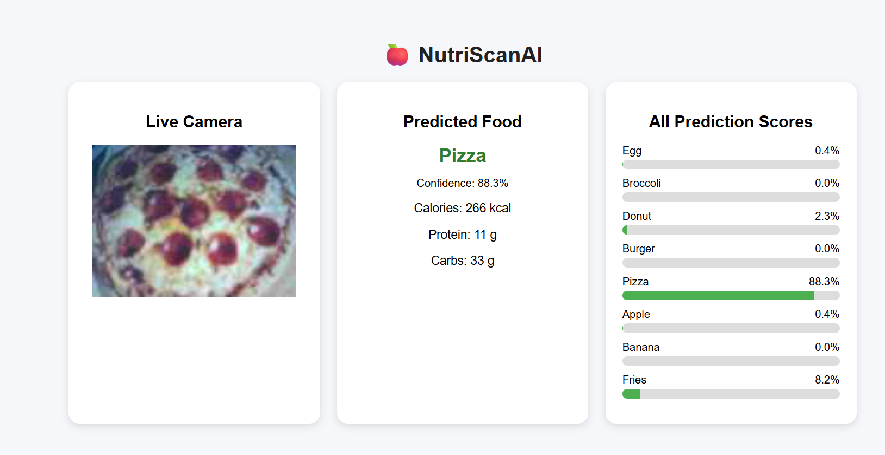

🍎 NutriScanAI
Real-Time Food Detection & Nutrition Display using OpenMV + TinyML

________________________________________
📌 Overview
NutriScanAI is an embedded AI system that detects food items in real time using an OpenMV Cam RT1062 and displays estimated nutritional information through a live web interface.
The system combines:
•	Edge AI (TinyML) for on-device image classification 
•	Serial + WebSocket communication for data transfer 
•	Browser UI for visualization 
________________________________________
👥 Team
•	Bhagya 
•	Deniz 
•	Hamza 
•	Ritika 
•	Venu 
________________________________________
🧠 How It Works
OpenMV Camera (TinyML)
        ↓ (Serial)
Python Bridge (serial_to_websocket.py)
        ↓ (WebSocket)
Server (server.py)
        ↓
Web UI (index.html)
Step-by-step:
1.	OpenMV captures images in real time 
2.	TinyML model classifies food into one of 8 categories 
3.	Prediction is sent via serial as JSON 
4.	Python bridge forwards data to WebSocket server 
5.	Server adds nutrition data 
6.	Browser displays: 
o	Detected food 
o	Confidence 
o	Nutrition values 
o	All prediction scores 
o	Live camera feed 
________________________________________
🍽️ Supported Food Classes
•	Apple 
•	Banana 
•	Broccoli 
•	Burger 
•	Donut 
•	Egg 
•	Fries 
•	Pizza 
________________________________________
⚙️ Technologies Used
•	OpenMV Cam RT1062 
•	Edge Impulse (TinyML) 
•	Python (asyncio, websockets, serial) 
•	HTML / CSS / JavaScript 
•	WebSocket communication 
________________________________________
🚀 Setup & Installation
1. Flash OpenMV
Upload the following files to OpenMV:
main.py  
trained.tflite  
labels.txt  
Then disconnect OpenMV IDE.
________________________________________
2. Install Python dependencies
pip install websockets pyserial
________________________________________
3. Run backend
Terminal 1:
python server.py
Terminal 2:
python serial_to_websocket.py
________________________________________
4. Open frontend
Open:
index.html
in your browser.
________________________________________
📷 Camera Streaming
✅ Recommended (Stable)
•	OpenMV serves snapshot images via HTTP 
•	Browser refreshes image periodically 
⚠️ MJPEG Streaming
•	Attempted but unstable under TinyML load 
•	OpenMV resource limitations affect performance 
________________________________________
🎯 Features
•	Real-time food detection (on-device AI) 
•	Confidence-based prediction filtering 
•	Nutrition lookup (calories, protein, carbs) 
•	Live camera visualization 
•	WebSocket-based real-time UI updates 
•	Lightweight embedded system 
________________________________________
⚠️ Limitations
•	Nutrition values are approximate (category-based) 
•	OpenMV cannot reliably handle: 
o	TinyML + MJPEG streaming simultaneously 
•	Frame rate depends on model complexity 
________________________________________
🧪 Example Output
{
  "food": "Banana",
  "calories": 89,
  "protein": 1.1,
  "carbs": 23
}
________________________________________
🧠 Key Learning Outcomes
•	Edge AI deployment on microcontrollers 
•	Real-time embedded system design 
•	Serial → WebSocket communication pipeline 
•	Handling hardware constraints in AI systems 
•	UI integration with embedded devices 
________________________________________
🚀 Future Improvements
•	Improve model accuracy with more training data 
•	Add portion size estimation 
•	Optimize streaming performance 
•	Deploy on Raspberry Pi for HDMI output 
•	Mobile app integration 
________________________________________
📄 License
This project builds upon OpenMV examples licensed under MIT.
________________________________________
💡 Final Note
NutriScanAI demonstrates how embedded AI can be connected to meaningful user interfaces, turning raw predictions into useful real-world insights.

