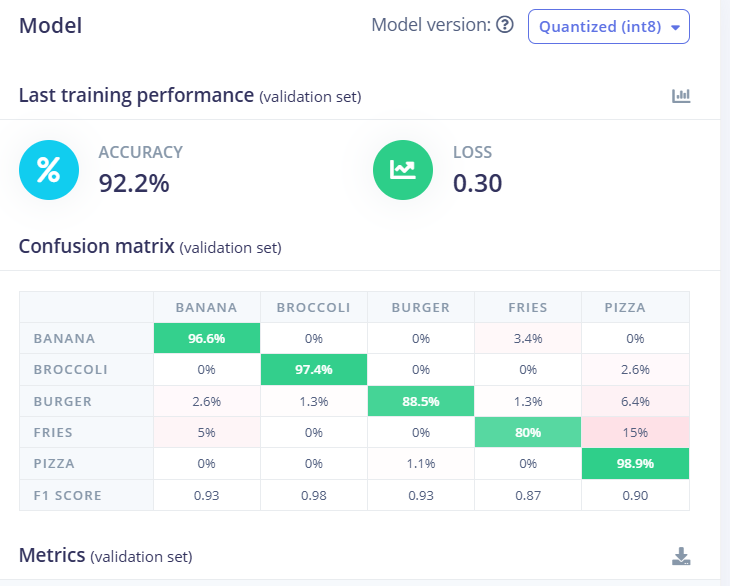
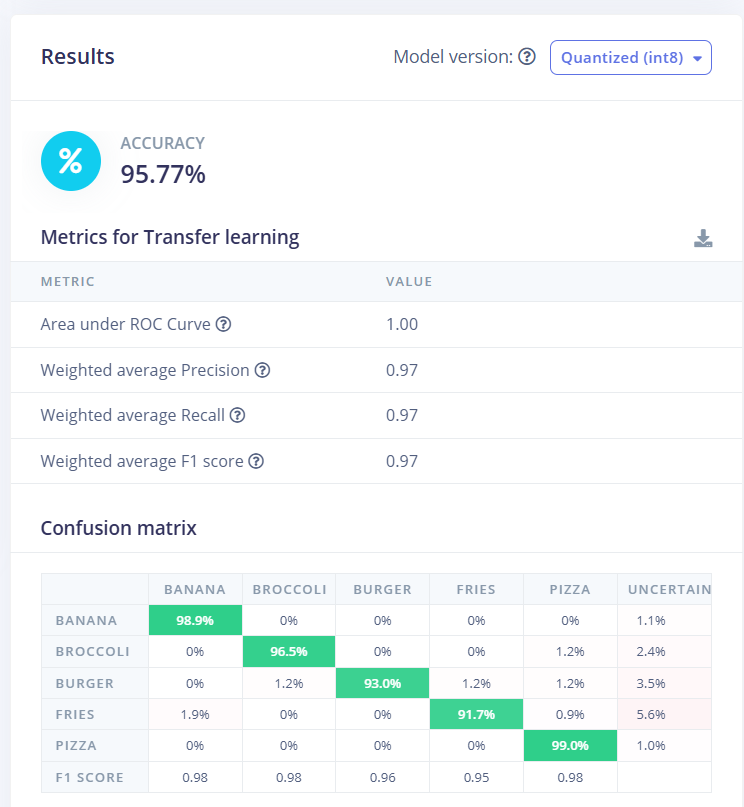

# Team updates
### Bhagyalakshmy 16/04/2026
1. I had initally created a model with food items on edge impulse , the real testing followed thorugh during the lab . Following food items were selected - Pizza, Hamburger, Chicken curry, beet salad , caesar salad, french fries, omelette
2. Although the model was performing poorly at 46% and then slowly rose to 70%
3. We realized that food items such as lasagna and chicken curry looked very similar especially Pizza was a food item which looked similar to most of the other food items.
4. Since the salad looked green which was similar in many pizzas, in totality the food classification was not performing very well in both RGB as well as greyscale conevrted
5. I started removing some food classifications to help in the model accuracy and thus we found that it rose to 70%
   
### Deniz Calik 16/04/2026
1. I created a github project repo and invited teammates 
2. The team found an idea on the lab section and discuss with Brendan : 
   (The OpenMV identifies the food in real time, and then a connected display system uses that detected class to look up and show nutrition information beside the live image.)
3. I searched some existing image data sets such as https://www.kaggle.com/datasets/trolukovich/food11-image-dataset?select=evaluation
4. I created readme file and sumurize the project in there with team member names including

### Ritika Mukerjee
16.04.2026-28.04.2026
1. After discussions with the team and the Luke we had finalized with the topic of real time food detection such that it would track the nutritional value as well for estimate. The goal of the project was to help identify the healthy food type and the unhealthy food type although the classifications are between different food types.
2. I had downloaded food items dataset from food-101 for 4 classes -Banana,donut,Beet Salad and french fries ( around 800 items) . After Bhaagya's baseline model I had found that further food items were causing more issues thus I decided on these 4 food items parallely Deniz was preparing his own model. Although since the main purpose of the model was to classify between healthy and unhealthy food items not by simple classificaiton but by fetch nutritional value the classifications could improve as we can cover more food items 
3. I trained the model with a mix of different images - such as some taken from the phone as well as the internet. Different lighting and backgrounds.
4. The training accuracy came to be 91% whereas the testing accuracy was around 89%
5. It was an upgrade from before but the gap was in calculating the nutritional value using web socket.
6. Collaborating with Deniz for further dataset expansion- 500 images of donut for his model.
7. The final classification will be in compilation of all the best classified food items, which help boost the accuracy
8. On 27th April, I and Deniz discussed over the Websocket and tried to get it working although it failed later on Deniz worked on it and it was successful

### Venu
16.04.2026-26.04.2026
1. I helped in research regarding the websocket during the meeting on Monday
2. I also helped in further assisting Deniz in his dataset collection.

### Hamza 
16.04.2026-26.04.2026
1. I helped in collecting egg class dataset for enhancing performance for Deniz 

### Deniz Calik 21/04/2026
1. To start with a simple step, I searched and dowloaded data images of 3 classes of food; Fries, Burger, Pizza
2. Approximately I had 1500 images for each.
3. in first attempt, I get 80% accuracy from transfer learning and 70% accuracy from a new trained model.
4. After trying different attemps and analysing the results I found the main problem.
5. The problem is that not all the images were clear or useful to train our model. even though they can be distungiushed, some of them were not good images for the model
6. I checked every image by one by for an hour, and I selected the best approx 500 images for each.
7. I retrained the model with transfer learning (MobileNetV2 96x96 0.35 (final layer: 16 neurons, 0.1 dropout)
8. the result is **95% accuracy for validation set and %93 percent for test set**
   
9. Next step is adding more classes with selected good image data.
10. I run the model and get it run on our edge device OpenMV Cam RT1062 These are the result images
     
     
     

    
11. **I also added video file that I recorded my working sample for this 3 classes with nutrition display added on the screen**
    
### Deniz Calik 23/04/2026
1. I collect around 500 images of banana by one by for an hour. because I could not find a single source that has useful banana images
2. I got 95% training accuracy, 95% test accuracy
### Deniz Calik 24/04/2026
1. I have selected and collected broccoli images around 500, by checking each to make sure they are good data for our system and camera
2. I have got 97% test accuracy for float32 unoptimized,
3. and 92% test accuracy int8 optimized
4. 
### Deniz Calik 24/04/2026
1. I run EON tuner to find best fit model for trsnsfer learning on Edge Impulse.
2. it turned out that mobilenetv1-38f is the best model that gives 95% accuracy for both val. and test accuracy which is very good.
### Deniz Calik 26/04/2026
1. I run EON tuner to find best fit model for trsnsfer learning on Edge Impulse again and got 3% accuracy improvment.

