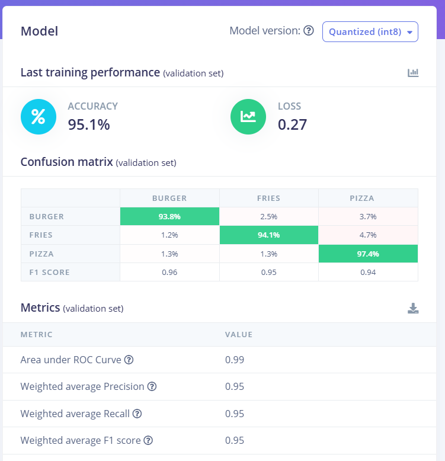
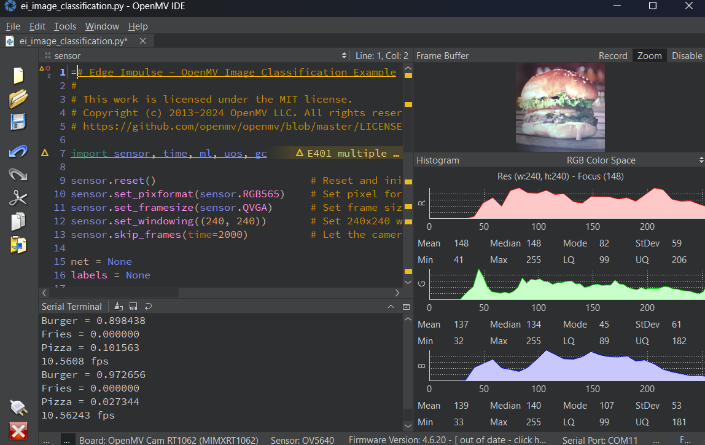
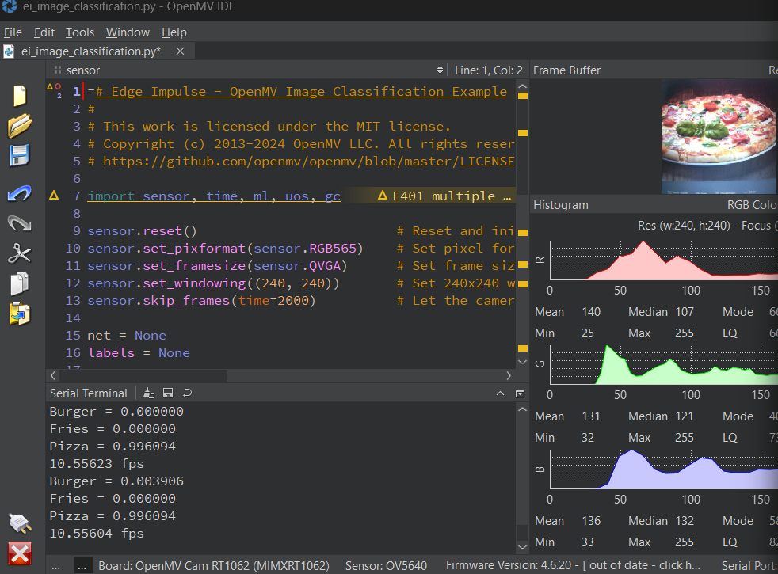
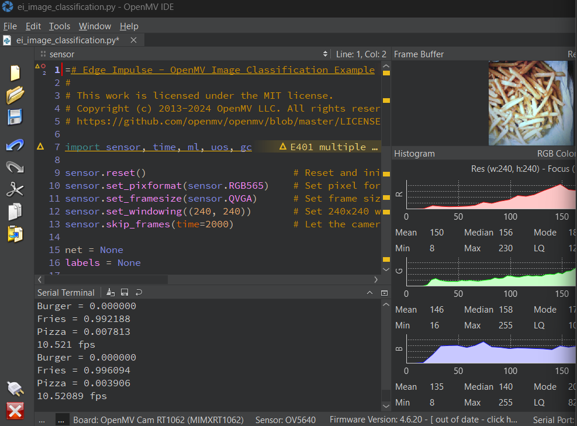

# Team updates

### Deniz Calik 16/04/2026
1. I created a github project repo and invited teammates 
2. I found an idea on the lab section and discuss with Brendan : 
   (The OpenMV identifies the food in real time, and then a connected display system uses that detected class to look up and show nutrition information beside the live image.)
3. I searched some existing image data sets such as https://www.kaggle.com/datasets/trolukovich/food11-image-dataset?select=evaluation
4. I created readme file and sumurize the project in there with team member names including

### Deniz Calik 21/04/2026
1. To start with a simple step, I searched and dowloaded data images of 3 classes of food; Fries, Burger, Pizza
2. Approximately I had 1500 images for each.
3. in first attempt, I get 80% accuracy from transfer learning and 70% accuracy from a new trained model.
4. After trying different attemps and analysing the results I found the main problem.
5. The problem is that not all the images were clear or useful to train our model. even though they can be distungiushed, some of them were not good images for the model
6. I checked every image by one by for an hour, and I selected the best approx 500 images for each.
7. I retrained the model with transfer learning (MobileNetV2 96x96 0.35 (final layer: 16 neurons, 0.1 dropout)
8. the result is **95% accuracy for validation set and %93 percent for test set**
   
9. Next step is adding more classes with selected good image data.
10. I run the model and get it run on our edge device OpenMV Cam RT1062 These are the result images
     
     
     

    
11. **I also added video file that I recorded my working sample for this 3 classes with nutrition display added on the screen**
    
### Deniz Calik 23/04/2026
1. I collect around 500 images of banana by one by for an hour. because I could not find a single source that has useful banana images
2. I got 95% training accuracy, 95% test accuracy
### Deniz Calik 24/04/2026
1. I have selected and collected broccoli images around 500, by checking each to make sure they are good data for our system and camera
2. I have got 97% test accuracy for float32 unoptimized,
3. and 92% test accuracy int8 optimized
4. 
